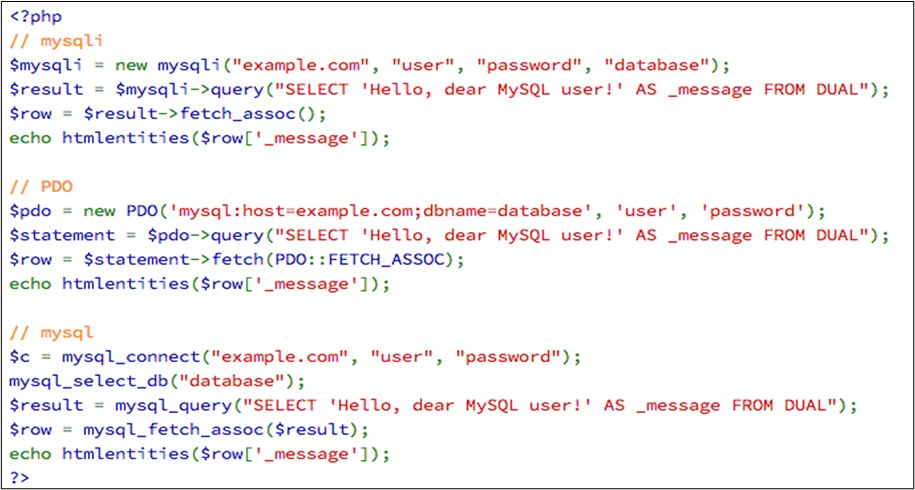

=== PHP et les bases de données

PHP propose de nombreux outils permettant de travailler avec la plupart des SGBDR

`Oracle, Sybase, Microsoft SQL Server, PostgreSQL ou encore MySQL` 

Lorsqu'une base de données n'est pas directement supportée par PHP, il est possible d'utiliser un driver ODBC (pilote standard) pour communiquer avec cette base.

PHP fournit un grand choix de fonctions permettant de manipuler les bases de données. 

Quatre groupes de fonctions sont essentielles  : 

*  La fonction de connexion au serveur de la BDD
*  La fonction du choix de la base de données 
*  Les fonction de requête (SQL)
*  La fonction de déconnexion.

PHP propose trois  outils pour manipuler les bases de données : 

.Optional Title
[NOTE]
mysqli, PDO, mysql

=== Fonctionnalités de l'API PDO

====== PHP Data Object (PDO) 

[WARNING]
On optera pour PDO pour l'accès aux bases.

[IMPORTANT]
Les bases de données relationnelles
[chart,line,file=""]
--
[WARNING]
Ne pas refaire le travail
--
[IMPORTANT]
Ceci est un test

